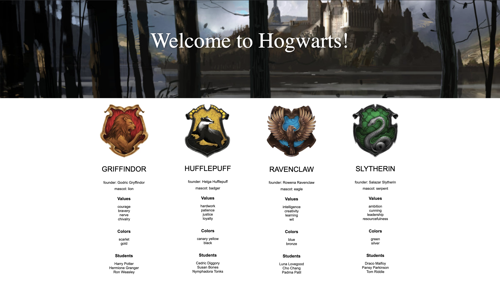

## Homework: JQHPHWLOL

# JQuery Harry Potter Homework

### Starter Code:

You are given an `index.html` and a `main.js` file.  The index.html is already outfitted with jQuery and connected to the main.js.  The index.html also has a header and main (a div-like element).

The main.js contains a familiar object with a Harry Potter information inside.

Your task is to create this website:

### Tips:

Remember your object basics!  Take some time inspecting the object and deciding how you can access the data you need to render.

Remember your jQuery basics! Today we talked about a handy workflow, keep this in mind as you work:

1.  Use your jQuery the parent you want to append to and save to a variable
2.  Create the element you want to create and modify the properties (i.e. `.css()`, `.text()`, `.attr()`, etc.)
3.  Append the new element to the selected parent from step 1.

### Guidance:
You do not have to do it this way, but check out the comments in the main.js if you want guidance!  Feel free to ignore them if you have a different idea.

### Requirements:
Each house needs to have:
* The name of the house
* The founder of the house
* The house mascot
* The values of the house
* The colors of the house
* The students of the house

All of which come from the `hogwarts` object in `main.js` file provided.

### Easy Bonus: Styling

Don't worry about styling, but if you want it to look like the image above, you can use the provided `style.css`.  To use the provided styles:

* each house should be a `<section>` tag appended to the `<main>` tag in the html.
* the name of the house should be in a `h2` tag
* the founder and the mascot should be in `p` tags
* each title (like 'values', 'colors', 'students') are an `h3` tag
* each of the items that go with titles are `li` tags inside of a `ul` tag.